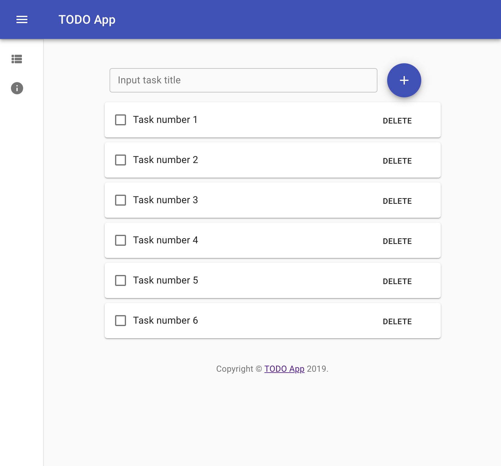

<!-- PROJECT SHIELDS -->
<!--
*** I'm using markdown "reference style" links for readability.
*** Reference links are enclosed in brackets [ ] instead of parentheses ( ).
*** See the bottom of this document for the declaration of the reference variables
*** for contributors-url, forks-url, etc. This is an optional, concise syntax you may use.
*** https://www.markdownguide.org/basic-syntax/#reference-style-links
-->
[![Contributors][contributors-shield]][contributors-url]
[![Forks][forks-shield]][forks-url]
[![Stargazers][stars-shield]][stars-url]
[![Issues][issues-shield]][issues-url]
[![MIT License][license-shield]][license-url]


<!-- PROJECT LOGO -->
<br />
<p align="center">
  <h3 align="center">Next.js + Apollo initial boilerplate</h3>

  <p align="center">
    An initial boilerplate built with Next.js + Apollo (Server & Client) + GraphQL + Sequelize + Material UI
    <br />
    <br />
    <a href="https://github.com/othneildrew/Best-README-Template/issues">Report Bug</a>
    ·
    <a href="https://github.com/othneildrew/Best-README-Template/issues">Request Feature</a>
  </p>
</p>


<!-- TABLE OF CONTENTS -->
## Table of Contents

* [About the Project](#about-the-project)
  * [Built With](#built-with)
* [Getting Started](#getting-started)
  * [Prerequisites](#prerequisites)
  * [Installation](#installation)
* [Usage](#usage)
* [Roadmap](#roadmap)
* [Contributing](#contributing)
* [License](#license)
* [Contact](#contact)
* [Acknowledgements](#acknowledgements)


<!-- ABOUT THE PROJECT -->
## About The Project

[](https://github.com/antrant/next-js-apollo-initial-boilerplate)

This repository is an initial point that help you can start a simple web application with Next.js and Apollo.
The application includes both GraphQL API and Frontend layers in a single source code (although these layers should be separated in the big project).
For database layer, the project use SQLite, which is easily be replaced with the other SQL databases such as MySQL, Postgres, MariaDB and Microsoft SQL Server.

### Built With
* [Next.js](https://nextjs.org)
* [Apollo Server](https://www.apollographql.com/docs/apollo-server)
* [Apollo Client](https://www.apollographql.com/docs/react)
* [Express](https://expressjs.com)
* [React](https://reactjs.org)
* [GraphQL](https://graphql.org)
* [Sequelize](https://sequelize.org)
* [SQLite](https://www.npmjs.com/package/sqlite3)
* [Material UI](https://material-ui.com)


<!-- GETTING STARTED -->
## Getting Started

### Prerequisites

You need to install these packages below to run the application locally.
* [Node.js](https://nodejs.org/en/)
* [Yarn](https://yarnpkg.com/lang/en/)

### Installation

1. Clone the repo
    ```shell script
    git clone https://github.com/antrant/next-js-apollo-initial-boilerplate.git
    ```
    then
    ```shell script
    cd /to/your/repo
    ```
2. Install Node packages
    ```shell script
    yarn install
    ```
3. Clone `.env` file from `.env.example`, change the file content to yours.
4. Run database migration:
    * Change `config/config.json` content to yours.
    * Run migration
    ```shell script
    npx sequelize-cli db:migrate
    ```
5. Start application in development mode
    ```shell script
    yarn dev
    ```


<!-- ROADMAP -->
## Roadmap

See the [open issues](https://github.com/antrant/next-js-apollo-initial-boilerplate/issues) for a list of proposed features (and known issues).


<!-- CONTRIBUTING -->
## Contributing

Contributions are what make the open source community such an amazing place to be learn, inspire, and create. Any contributions you make are **greatly appreciated**.

1. Fork the Project
2. Create your Feature Branch (`git checkout -b feature/AmazingFeature`)
3. Commit your Changes (`git commit -m 'Add some AmazingFeature'`)
4. Push to the Branch (`git push origin feature/AmazingFeature`)
5. Open a Pull Request


<!-- LICENSE -->
## License

Distributed under the MIT License. See [`LICENSE`](https://github.com/antrant/next-js-apollo-initial-boilerplate/blob/master/LICENSE) for more information.


<!-- CONTACT -->
## Contact

An Tran - [@AnTranIO](https://twitter.com/AnTranIO)

Project Link: [Next.js Apollo Initial Boilerplate](https://github.com/antrant/next-js-apollo-initial-boilerplate)


<!-- ACKNOWLEDGEMENTS -->
## Acknowledgements


<!-- MARKDOWN LINKS & IMAGES -->
<!-- https://www.markdownguide.org/basic-syntax/#reference-style-links -->
[contributors-shield]: https://img.shields.io/github/contributors/antrant/next-js-apollo-initial-boilerplate.svg?style=flat-square
[contributors-url]: https://github.com/antrant/next-js-apollo-initial-boilerplate/graphs/contributors
[forks-shield]: https://img.shields.io/github/forks/antrant/next-js-apollo-initial-boilerplate.svg?style=flat-square
[forks-url]: https://github.com/antrant/next-js-apollo-initial-boilerplate/network/members
[stars-shield]: https://img.shields.io/github/stars/antrant/next-js-apollo-initial-boilerplate.svg?style=flat-square
[stars-url]: https://github.com/antrant/next-js-apollo-initial-boilerplate/stargazers
[issues-shield]: https://img.shields.io/github/issues/antrant/next-js-apollo-initial-boilerplate.svg?style=flat-square
[issues-url]: https://github.com/antrant/next-js-apollo-initial-boilerplate/issues
[license-shield]: https://img.shields.io/github/license/antrant/next-js-apollo-initial-boilerplate.svg?style=flat-square
[license-url]: https://github.com/antrant/next-js-apollo-initial-boilerplate/blob/master/LICENSE
